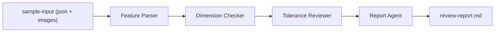

# Microsoft Agent Framework 圖面審查流程教學範例

這是一個最小、可教學、可直接執行的 C# CLI 範例，示範如何使用 Microsoft Agent Framework 建立 sequential workflow，並透過 GitHub Models 讓多個 Agent 依序完成圖面審查。現在的 `sample-input` 已支援「1 個 JSON + 0~N 張圖片」一起送進 LLM。

## 目標

- 使用 `Feature Parser`、`Dimension Checker`、`Tolerance Reviewer`、`Report Agent` 四個 Agent 串接成單一路徑。
- 輸入 feature JSON、尺寸資料、圖面說明，並可附帶多張圖面圖片。
- 輸出一份 Markdown 審查報告，方便技術文章展示與二次擴充。

## 架構



## 技術選型

- .NET 9 Console App
- Microsoft Agent Framework `Microsoft.Agents.AI.Workflows`
- GitHub Models Inference API
- `GITHUB_TOKEN` 環境變數做認證

## 先決條件

1. 已安裝 .NET SDK 9 或更新版本。
2. 已建立 GitHub Personal Access Token，並具備 `models:read` 權限。
3. 已設定環境變數 `GITHUB_TOKEN`。

PowerShell 範例：

```powershell
$env:GITHUB_TOKEN = "your_token_here"
```

## 執行方式

直接執行 `sample-input` 目錄：

```powershell
dotnet run
```

指定自訂輸入目錄與輸出路徑：

```powershell
dotnet run -- --input .\sample-input --output .\output\review-report.md
```

相容舊模式，直接指定單一 JSON 檔也可以：

```powershell
dotnet run -- --input .\sample-input\review-request.json --output .\output\review-report.md
```

## sample-input 契約

`sample-input` 目錄每次只代表一筆審查案例，規則如下：

- 目錄中可有 0 或 1 個 JSON 檔。
- 可另外放 0 到多張圖片。
- 支援的圖片格式：`.png`、`.jpg`、`.jpeg`、`.webp`。
- 程式會自動收集該目錄中的 JSON 與圖片，並一起送到 GitHub Models。
- 若只有圖片、沒有 JSON，程式會自動建立一筆最小輸入，讓流程可直接從圖面開始審查。

目前範例主檔位於 `sample-input/review-request.json`，目錄說明位於 `sample-input/README.md`。

## 輸入格式

JSON 欄位如下：

- `partName`
- `featureJson`
- `dimensionData`
- `drawingNotes`

圖片不需要出現在 JSON 內，只要放在同一個輸入目錄即可。
若完全沒有 JSON，`partName` 會預設採用資料夾名稱，其餘文字欄位會以系統預設說明補齊。

## 模型切換邏輯

本範例預設會自動選模型：

- 純文字輸入：`openai/gpt-4.1-mini`
- 有圖片輸入：`openai/gpt-4.1`

Endpoint 固定為：

- `https://models.github.ai/inference/chat/completions`

如果你的 GitHub Models 帳號方案或可用模型不同，可以在 `Models/ReviewWorkflowOptions.cs` 修改預設模型。

## 輸出格式

最終輸出為 Markdown 報告，固定包含以下段落：

- `## 零件摘要`
- `## 尺寸問題清單`
- `## 公差問題清單`
- `## 建議修正`
- `## 整體結論`

預設輸出位置為 `output/review-report.md`。

## 專案結構

- `Program.cs`: CLI 入口。
- `Models/`: 輸入、輸出、設定與 workflow 型別。
- `Services/`: GitHub Models 呼叫、輸入載入、報告輸出。
- `Workflow/`: Agent Workflow 建立與執行。
- `sample-input/`: 範例輸入與目錄契約說明。
- `docs/`: 技術文章可引用的補充文件。

## 設計取捨

- 刻意採用 CLI，而非 Web API，讓範例更容易講解。
- 四個 Agent 全部使用 LLM 驅動，但職責切分保持很窄。
- 不加入資料庫、Web UI、佇列或 session persistence，聚焦在 workflow 概念。
- 圖片只在 `Feature Parser` 階段直接送入模型，後續改用結構化結果往下傳，降低 token 成本。

## 延伸方向

- 把 `ReviewRequest` 改成直接讀 Creo、STEP 或圖面抽取結果。
- 在 `Dimension Checker` 增加尺寸鏈閉合規則。
- 在 `Tolerance Reviewer` 引入更多公司內部標註規範。
- 改為 Web API 或背景工作服務，接到實際審圖流程。

## 文件

- [docs/project-plan.md](/C:/Vulcan/Projects/Agent-Test/docs/project-plan.md)
- [docs/workflow-overview.md](/C:/Vulcan/Projects/Agent-Test/docs/workflow-overview.md)
