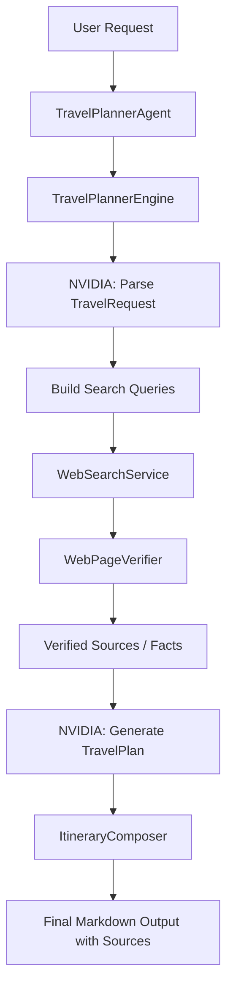

# 專案計畫

## 專案目標

建立一個簡潔、可執行、可寫成技術文章的旅遊規劃 Agent 範例。專案使用 Microsoft Agent Framework 作為 Agent 抽象層，並以 NVIDIA 免費模型資源作為主要 LLM。

使用者可以透過：

- 無參數直接進入 `repl`
- `plan`：一次輸入需求，取得完整旅遊行程
- `repl`：明確指定連續對話模式

## 技術決策

### 1. 採用 C# Console

這個專案刻意選擇 `C# Console`，因為：

- 與 Microsoft Agent Framework 文件脈絡一致
- 程式入口清楚，適合文章示範
- 比 Web UI 更容易聚焦在 Agent 流程本身

### 2. 採用自訂 `AIAgent`

本專案沒有強行把搜尋做成模型原生 tool-calling，而是採用更容易理解的方式：

- `TravelPlannerAgent : AIAgent`
- Agent 內部委派給 `TravelPlannerEngine`
- Engine 以程式碼方式協調搜尋、驗證、生成與輸出

這種做法保留了 Agent Framework 的 session / lifecycle / invocation 模型，同時維持範例簡單。

### 3. 搜尋策略採零額外 API Key

為了降低範例門檻，搜尋端不依賴第三方搜尋 API，而是直接抓取可公開查詢的搜尋結果頁，再進一步驗證來源內容。

驗證時優先保留：

- 官方網站
- 觀光局或旅遊局頁面
- 交通營運商官網
- 住宿或飯店官網

## 啟動與互動設計

CLI 行為固定如下：

- 無參數：直接進入 REPL
- `help` / `--help` / `-h`：顯示用法
- `repl`：明確指定 REPL
- `plan --request "..."`：輸出單次行程

REPL 啟動時會先設定 `Console.InputEncoding` 與 `Console.OutputEncoding` 為 UTF-8。

若程式偵測到輸入流直接回傳 EOF/null，代表目前不是互動式標準輸入環境；此時會顯示提示訊息並結束，避免看起來像程式異常秒退。

## 模組說明

### `AppOptions`

負責從環境變數讀取 NVIDIA API Key。

規則：

- 優先讀取 `Navidia_Vulcan`
- 若沒有，再 fallback 到 `NVIDIA_API_KEY`

### `NvidiaChatClient`

封裝 NVIDIA：

- `POST https://integrate.api.nvidia.com/v1/chat/completions`

程式目前將回應內容視為 JSON 字串來源，並負責從 markdown code fence 或純文字中抽出 JSON 再反序列化。

### `WebSearchService`

負責：

- 送出搜尋查詢
- 擷取候選結果
- 過濾空白、重複與無效 URL

### `WebPageVerifier`

負責：

- 抓取網頁 HTML
- 擷取 `<title>`
- 擷取 meta description
- 從段落中找出可作為事實的文字

這一層的目的不是理解整個網站，而是提供「足夠可引用的已驗證資訊」。

### `TravelPlannerEngine`

負責整體流程：

1. 用 LLM 將需求解析為 `TravelRequest`
2. 依需求產生搜尋查詢
3. 搜尋並抓取候選來源
4. 驗證來源並抽出事實
5. 再次呼叫 LLM，根據已驗證資料產生 `TravelPlan`
6. 交由 `ItineraryComposer` 組成最終輸出

### `ItineraryComposer`

這一層是最後的守門員。

規則：

- 若行程中的景點 / 交通 / 住宿找不到對應來源，直接拒絕輸出
- 輸出固定附上來源清單

## 資料流程

## 測試策略

本專案目前採用 xUnit，測試分成三層：

### 單元測試

- 環境變數讀取
- 需求模型 JSON 解析
- 搜尋結果清理
- HTML 驗證萃取
- 行程來源驗證

### 整合測試

以 fake/stub 方式模擬：

- `INvidiaChatClient`
- `IWebSearchService`
- `IWebPageVerifier`

藉此驗證 `TravelPlannerAgent` 的：

- `RunAsync`
- session 記憶
- `reset` 清空行為

### 啟動層測試

- 無參數時進入 REPL
- `help` 只顯示用法
- `plan --request` 維持單次輸出
- 標準輸入為 EOF/null 時顯示明確提示

### 文件與編碼

專案加入 `.editorconfig`，明確指定：

- `README.md`
- `docs/*.md`
- `*.cs`
- `*.json`

皆使用 UTF-8。

這次修正也把已污染的中文字串視為內容 bug，一併重建，而不是只依賴編碼設定。

## 目前限制

- 尚未針對搜尋引擎頁面結構變動做強化保護
- 尚未做來源可信度分級
- 尚未提供真正的訂房或訂票功能
- 尚未保證即時票價 / 房價
- 尚未對長對話做摘要壓縮

## 後續可擴充方向

- 增加來源排序與可信度評分
- 增加日期、預算與地理距離約束
- 增加結構化輸出格式，例如 JSON / Markdown 雙輸出
- 增加快取，減少重複抓取網頁
- 增加命令列參數，例如 `--days`、`--budget`、`--destination`

## 文件同步規則

後續若有任何功能異動，至少同步更新：

- `README.md`
- `docs/project-plan.md`

若命令、環境變數、輸出格式或模組責任有變動，這兩份文件必須在同一次修改中一併更新。
